# COVID---19-Spread-Analysis

COVID – 19 SPREAD ANALYSIS using Kermack McKendrick SIR Epidemic model (with some modifications)

Need for COVID – 19 spread analysis:

The virus spreads mainly through respiratory droplets that can affect people who are near an infected person. Public health surveillance is a program by the Center for Disease Control in USA, which involves  systematic collection, analysis, and interpretation of health-related data.

For surveillance of COVID-19, CDC is using multiple surveillance systems run in collaboration with state, local, territorial, and academic partners. COVID-19 can cause mild to severe illness; most severe illness occurs in adults 65 years and older and people of any age with serious underlying medical problems.

CDC monitors COVID-19 disease spread in the United States and provides updates and interim guidance to the people. WHO officials cautioned it is too early to tell if the spread will slow, and thus for essential planning, implementation, and evaluation of public health practice; up to date COVID – 19 spread analysis is vital.

More than half of U.S. states have stay-at-home orders, and when will it be safe to lift restrictions is also an important question from an economic point of view. Among these questions and many more, important from all perspectives, we study how to perform COVID – 19 spread analysis.

 

Fig. 1: Supposed microscopic view of the virus. 

Hyperparameters used / assumptions made during the project:

I have studied the spread of COVID – 19 for two different contact networks, called as pre and post lockdown contact networks.

The biggest assumption made for the pre lockdown model is that 68 % of people choose to go out, on an average, on any given day. This assumption is made keeping in mind that around 32 % of people might include toddlers, elderly people, sick people, people who might have off days, people who already work from home, etc.

Further assumptions in the pre lockdown model include the maximum number of people that you can come in contact with (within 6 feet) as 90 in a day, and the minimum as 12 a day.

Similarly post lockdown, I have assumed 24 % people going out, which includes people who work in essential services such as healthcare, police, grocery stores, etc.

Further assumptions in the post lockdown model include the maximum number of people that you can come in contact with (within 6 feet) as 45 in a day, and the minimum as 6 a day.

For models segregating young (< 50 years) and old (> 50 years) population, I have assumed the rates of infection and deaths of old people as twice that of the young population.

The final assumption is that the rates of infection and deaths do not change with time, and remain same pre and post lockdown.

 

Fig. 2: Post lockdown streets. 

How does the disease spread? :

The virus is thought to spread mainly from person-to-person. People are thought to be most contagious when they are symptomatic (showing symptoms).

The virus has an incubation period of between two to 14 days, so it is possible to carry and spread the disease before you know you are sick. People can also be infected by touching a contaminated surface and then their eyes, mouth or nose.

The most common symptoms of COVID-19 are fever, dry cough, and tiredness. Throughout the world, social distancing to slow the spread of coronavirus has become a new normal.

Unfortunately, the only way to truly know if someone has COVID-19 is to test them—that’s because the symptoms of the illness may look extremely similar to that of the common cold or flu: cough, fever, body aches. The best way to prevent illness is to avoid being exposed to this virus.

 

Fig. 3: Prevention is better than cure. 

How does any communicable disease spread? :

“As a matter of fact, the variation of disease from time to time, must be considered mathematically, if it is to be considered scientifically at all.”
				         - Sir Ronald Ross, MD

The most frequent infectious diseases in humans—and those with the highest potential for rapid pandemic spread—are usually transmitted via droplets during Close Proximity Interactions (CPIs). CPIs occur through individual-to-individual contact: through a sneeze or cough, through skin-skin contact, or through exchange of body fluids.

Analysis of targeted immunization strategies suggested that contact network data are required to design strategies that are significantly more effective than random immunization. Simple tools from calculus allow us to extract a great deal of information from these contact networks.

 

Fig. 4: Isolation / quarantining is necessary for infected patients. 

How do we study contact among people? :

We try to study contacts through Contact Networks, which are similar to Social Media networks, that are formed by studying the contact among people living in communities, small villages, towns or large cities.

 
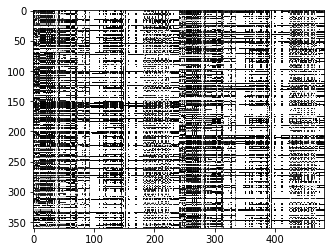

Fig. 5.a: A sample of pre lockdown contact network data.

 
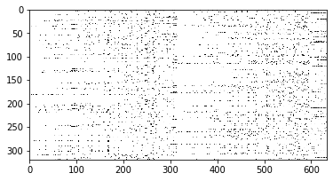

Fig. 5.b: A sample of post lockdown contact network data.

What are the rates of infection, deaths? :

Here we make no assumptions, and use the actual data available on the internet, and determine the rates ourselves. We investigate the rates of infection and deaths according to CDC data.

I trained a neural net model with four hidden layers to study these rates. I used the data for spread of infection for first 18 days, and increase in number of deaths for first 25 days.

 
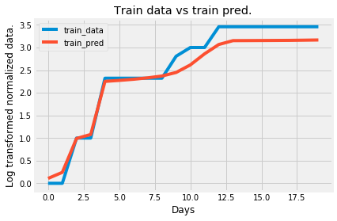

Fig. 6.a: Train data vs train pred for spread of infection.

Results:

Initial number of cases: 1

Number of days to double the cases: 3

 
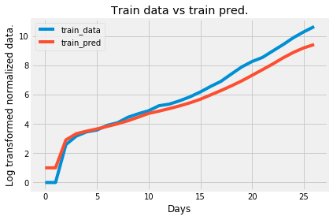

Fig. 6.b: Train data vs train pred for increase in number of deaths.

Results:

Initial number of deaths: 2

Number of days to double the deaths: 3
 

How do we study the spread of epidemic / pandemics? :

The SIR (susceptible-infected-removed) model, developed in the early twentieth century, consists of a system of three coupled non-linear ordinary differential equations, which does not possess an explicit formula solution.

We use the SIR epidemic model which was first used to model the pandemic / epidemic in 1920s, to analyze human to human transmission of communicable disease. This algorithm was once mentioned as state of the art by Center for Disease Control in USA.

And here I implement a modified SIR epidemic model with the rates of infection and deaths studied previously, to predict the outcomes over 100 days.

 

Fig. 7: SARCD for no lockdown model with no segregation of population.
 

Do the rates for infection and deaths, remain same for all the population? :

No. The studies have showed people above 50 years of age are more likely victims.

Here I assume double rates for around 34 % of population, who are above 50 years of age.

 
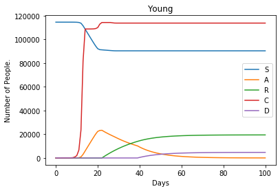

Fig. 8.a: SARCD for no lockdown model for young people.

 
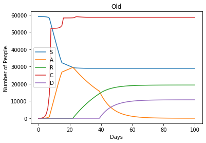

Fig. 8.b: SARCD for no lockdown model for old people.
 

Does lockdown have any effect? More importantly when should lockdown start to have effects. :

We test a lockdown after 55 days model, which was chosen by the last US state, to start lockdown.

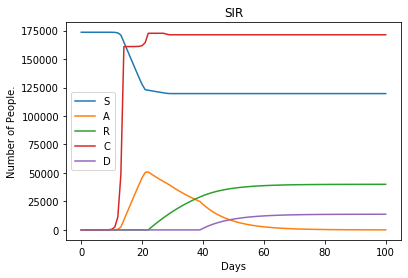 
 
Fig. 9.a: SARCD for lockdown after 55 days.

Fig. 9.b: SARCD for lockdown after 55 days for young people.

Fig. 9.c: SARCD for lockdown after 55 days for old people.

We test a lockdown after 35 days model, which was chosen by the first US state, to start lockdown.

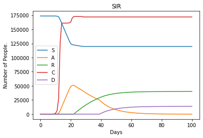

Fig. 10.a: SARCD for lockdown after 35 days.

Fig. 10.b: SARCD for lockdown after 35 days for young people.

Fig. 10.d: SARCD for lockdown after 35 days for old people.

We test a lockdown after 15 days model, which was chosen as the one with the most impact.

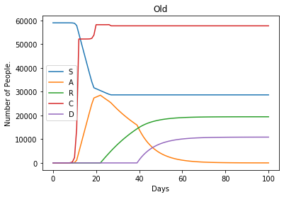

Fig. 11.a: SARCD for lockdown after 15 days.
 

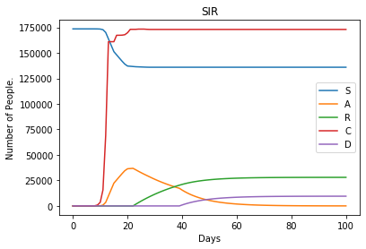

Fig. 11.b: SARCD for lockdown after 15 days for young people.

Fig. 11.c: SARCD for lockdown after 15 days for old people.
 

Can testing help? Assuming testing is followed by isolation or quarantine, for high risk cases.:

With no testing:

Here we see the spread of COVID - 19 pre lockdown.

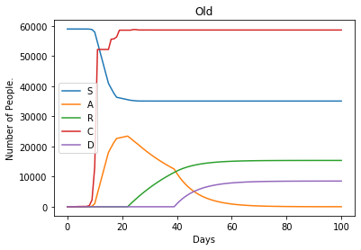

Fig. 12.a: Spread of COVID – 19 pre lockdown .

Here we see the spread of COVID - 19 post lockdown.

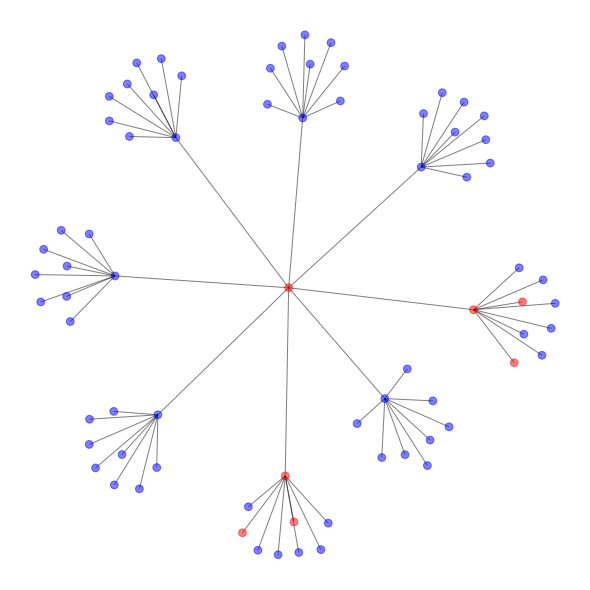

Fig. 12.b: Spread of COVID – 19 post lockdown.
 

With testing:

Here we see the spread of COVID - 19 pre lockdown.

 
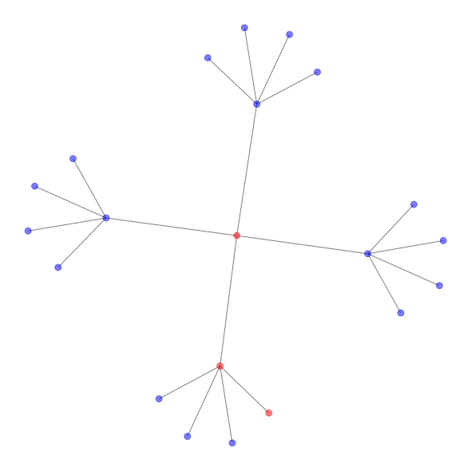

Fig. 13.a: Spread of COVID – 19 pre lockdown.
 

Here we see the spread of COVID - 19 post lockdown.

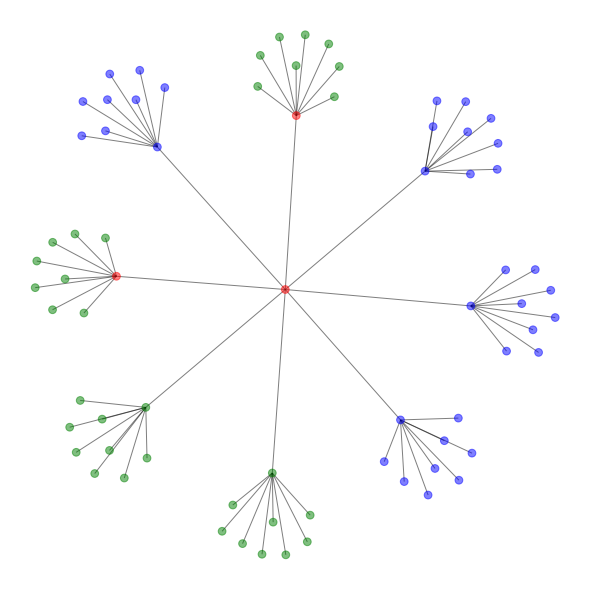

Fig. 13.b: Spread of COVID – 19 post lockdown. 
 

References:

1.	https://www.cdc.gov/coronavirus/2019-ncov/cases-updates/cases-in-us.html

2.	https://www.worldometers.info/coronavirus/country/us/

3.	http://mat.uab.cat/matmat/PDFv2013/v2013n03.pdf

4.	https://www.pnas.org/content/107/51/22020
